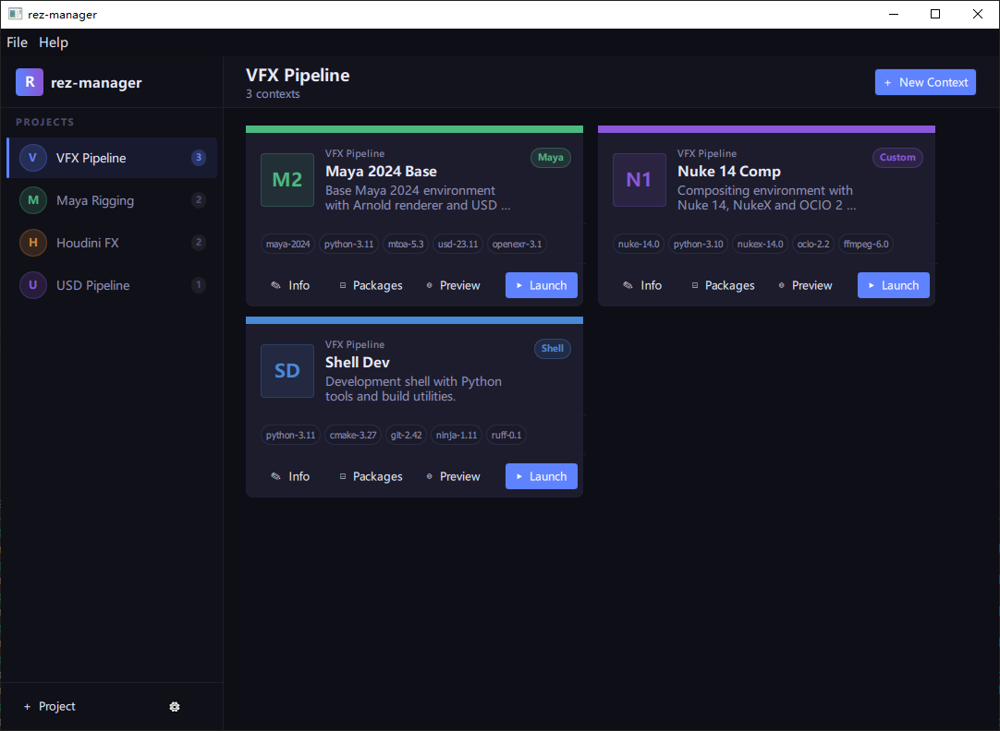

# rez-manager

A GUI tool for managing [Rez](https://rez.readthedocs.io/en/stable/) package environments.



## Setup

Requires [uv](https://docs.astral.sh/uv/).

```bash
uv sync
uv run rez-manager
```

## Build

```bash
uv run pyinstaller --name rez-manager --windowed -y --clean ./src/rez_manager/__main__.py
```

## Development

```bash
uvx ruff check src      # Lint
uvx ruff format src     # Format
uv run pytest           # Test
pyside6-qml-stubgen.exe src --out-dir ./qmltypes
pyside6-qmllint -I ./qmltypes <qml-files>
```

`qmltypes/` is generated output and is intentionally not tracked in git.

For correct QML hints and completion in editors such as VS Code, generate QML type stubs with
`pyside6-qml-stubgen.exe src --out-dir ./qmltypes`, then add `./qmltypes` to
`qt-qml.qmlls.additionalImportPaths`.

To lint QML files against those generated types, use
`pyside6-qmllint -I ./qmltypes <qml-files>`.

## Project Layout

```
src/rez_manager/
├── adapter/    # Rez API wrapper (only layer that imports rez.*)
├── models/     # Data models (pure Python)
├── ui/         # PySide6 controllers exposed to QML
└── qml/        # QML UI files
docs/
├── design.md          # UI and architecture design reference
└── rez-knowledge.md   # Rez AI context / anti-hallucination guide
```

See `docs/design.md` for full architecture and UI specification.

## License

MIT. See `LICENSE`.
