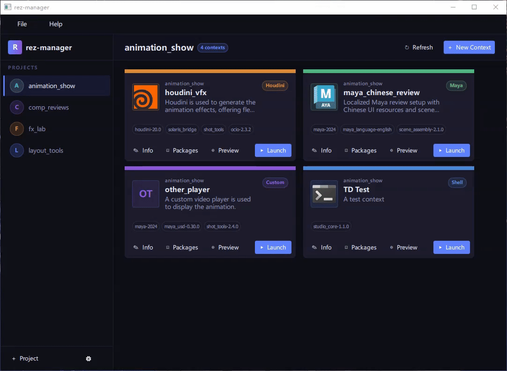

# rez-manager

[中文说明](./README.zh-CN.md)

A modernized GUI tool for managing [Rez](https://rez.readthedocs.io/en/stable/) package environments.

rez-manager provides a desktop UI for creating, editing, previewing, and launching Rez contexts
for DCC workflows.

## Current Limitations

- This application has only been tested on Windows. Other platforms are not supported yet.
- rez-manager does not create Rez packages. Users need to create and maintain packages manually
 according to the [Rez documentation](https://rez.readthedocs.io/en/stable/package_definition.html).

## Features

### Group your rez contexts by project



### Launch DCC software by one click


### Select which DCC software to launch with each context


### Config the dependencies packages for each context


### Preview the resolved environment for each context


### Debug the context during packages configuration


### Easy access the error logs when something goes wrong


## Example Data

The [`./examples`](./examples) directory contains sample projects and Rez packages for trying the
application quickly. Point the app settings to those example directories to preview the main
features without preparing your own package repository first.

## Setup and Build

### Requirements

- [uv](https://docs.astral.sh/uv/)

`uv` will provision the required Python version from the project metadata when needed.

### Run from source

```bash
uv sync
uv run rez-manager
```

### Run from pre-built executable

Pre-built executables can be downloaded from the [Releases](https://github.com/FhyTan/rez-manager/releases) page.

### Build a desktop executable

```bash
uv run pyinstaller --name rez-manager --windowed -y --clean ./src/rez_manager/__main__.py
```

## Development

### Commonly used commands

```bash
uvx ruff check src      # Lint
uvx ruff format src     # Format
uv run pytest           # Test
pyside6-qml-stubgen.exe src --out-dir ./qmltypes
pyside6-qmllint -I ./qmltypes <qml-files>
```

`qmltypes/` is generated output and is intentionally not tracked in git.

For correct QML hints and completion in editors such as VS Code, generate QML type stubs with
`pyside6-qml-stubgen.exe src --out-dir ./qmltypes`, then add `./qmltypes` to
`qt-qml.qmlls.additionalImportPaths`.

To lint QML files against those generated types, use
`pyside6-qmllint -I ./qmltypes <qml-files>`.

### Project layout

``` txt
src/rez_manager/
├── adapter/              # Rez API wrapper (only layer that imports rez.*)
├── data/                 # Static application data bundled with the app
├── hooks/                # PyInstaller hooks for bundled runtime behavior
├── models/               # Data models (pure Python)
├── persistence/          # Filesystem storage and project/context persistence
├── qml/                  # QML UI files
├── resources/            # Images and other packaged application assets
├── ui/                   # PySide6 controllers exposed to QML
└── app.py                # Application bootstrap and top-level startup wiring
docs/
├── design.md          # UI and architecture design reference
└── rez-knowledge.md   # Rez AI context / anti-hallucination guide
tests/
├── adapter/           # Adapter layer tests
├── models/            # Pure model tests
├── persistence/       # Storage and serialization tests
├── runtime/           # Runtime and exception hook tests
└── ui/                # Controller and QML-facing behavior tests
```

`adapter/` is the only layer allowed to import `rez.*`. `models/` stays pure Python, `ui/`
bridges Python and QML, and `qml/` contains the declarative interface.

See `docs/design.md` for the detailed architecture and UI specification.

## License

MIT. See `LICENSE`.
